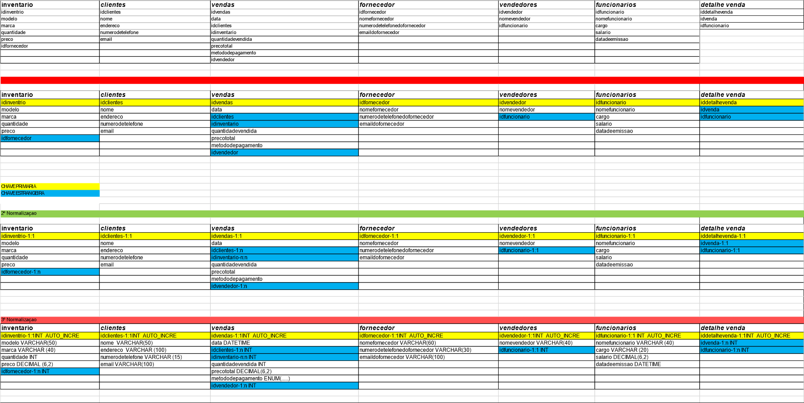
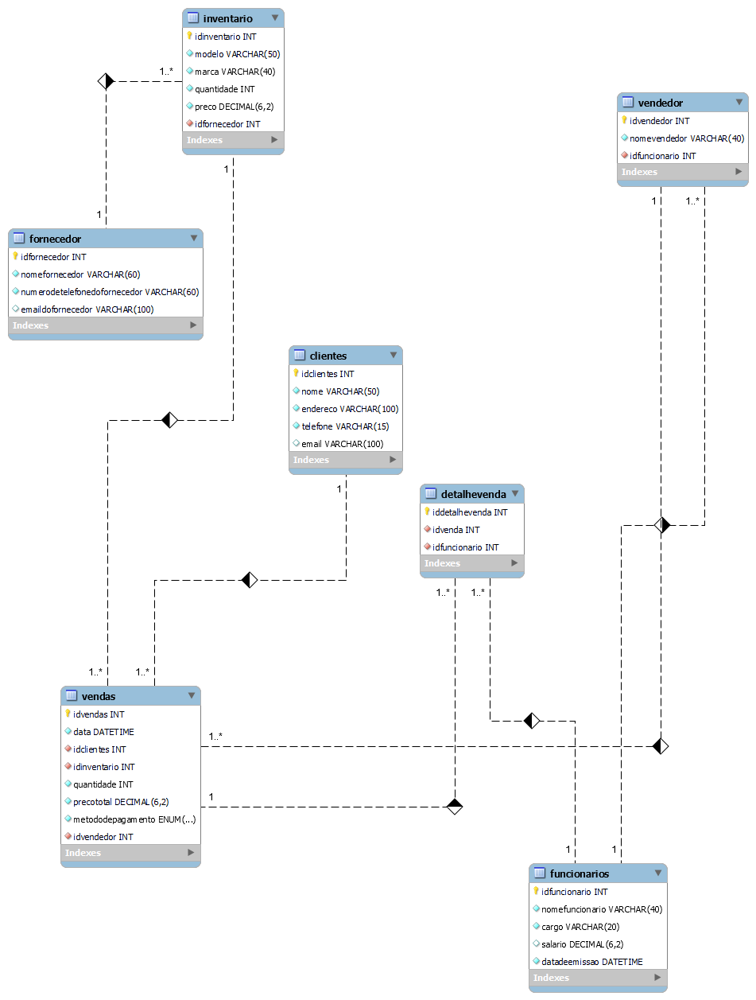

# Estudo  do caso Bike Shop

 

### Bike Shop

Visão Geral: A BikeShop é uma empresa especializada na venda de bicicletas e acessórios relacionados. Localizada em uma área urbana movimentada de Uberlândia, Minas Gerais, a empresa tem como objetivo oferecer uma variedade de bicicletas de alta qualidade para ciclistas de todos os níveis, desde iniciantes até ciclistas experientes e entusiastas.

Desafio: A BikeShop está crescendo rapidamente e enfrenta desafios no gerenciamento eficiente de seu inventário, clientes e vendas. Atualmente, eles estão registrando essas informações manualmente ou usando planilhas eletrônicas, o que se tornou ineficiente e propenso a erros. Eles reconhecem a necessidade de um sistema de banco de dados centralizado que possa armazenar e gerenciar essas informações de forma mais eficaz.

Objetivos do Sistema de Banco de Dados: Gerenciar o inventário de bicicletas e acessórios, incluindo detalhes como modelo, marca, quantidade em estoque, preço de venda e fornecedor. Manter um registro centralizado de clientes, incluindo informações como nome, endereço, número de telefone, endereço de e-mail e histórico de compras. Registrar e acompanhar as vendas de bicicletas e acessórios, incluindo detalhes como data da venda, produtos vendidos, preço de venda, método de pagamento e vendedor responsável.

Requisitos Funcionais do Sistema de Banco de Dados: Capacidade de adicionar, atualizar e excluir itens do inventário, bem como verificar a disponibilidade de produtos em tempo real. Capacidade de adicionar novos clientes, atualizar informações existentes e manter um histórico de suas compras anteriores. Funcionalidade para registrar novas vendas, incluindo a associação dos produtos vendidos aos clientes correspondentes e a geração de recibos. Recursos de segurança para proteger os dados do cliente e do inventário contra acesso não autorizado. Capacidade de gerar relatórios de vendas, análises de estoque e dados do cliente para ajudar na tomada de decisões comerciais.

Abordagem Proposta: A BikeShop planeja desenvolver um sistema de banco de dados personalizado usando tecnologias modernas de banco de dados, como MySQL ou PostgreSQL. Eles planejam colaborar com desenvolvedores de software especializados para projetar e implementar o sistema de acordo com seus requisitos específicos. O sistema será acessado por funcionários autorizados por meio de uma interface de usuário intuitiva, onde poderão realizar todas as operações necessárias de forma eficiente.

Benefícios Esperados: Melhoria na eficiência operacional, permitindo que a BikeShop gerencie seu inventário, clientes e vendas de forma mais rápida e precisa. Maior satisfação do cliente, oferecendo um serviço mais personalizado e mantendo um histórico detalhado das interações anteriores. Melhoria na tomada de decisões comerciais com base em relatórios e análises de dados precisos e atualizados. Com um sistema de banco de dados eficiente e bem projetado, a BikeShop está confiante de que poderá atender às demandas de seus clientes de maneira mais eficaz e continuar prosperando no mercado de bicicletas.

Modelo lógico para o estudo de caso Tabelas: Inventário: ID_Inventario (Chave Primária) Modelo Marca Quantidade Preço ID_Fornecedor (Chave Estrangeira referenciando a tabela de Fornecedores) Clientes: ID_Cliente (Chave Primária) Nome Endereço Número_de_Telefone Email Vendas: ID_Venda (Chave Primária) Data ID_Cliente (Chave Estrangeira referenciando a tabela de Clientes) ID_Inventario (Chave Estrangeira referenciando a tabela de Inventário) Quantidade_Vendida Preço_Total Método_de_Pagamento ID_Vendedor (Chave Estrangeira referenciando a tabela de Vendedores) Fornecedores: ID_Fornecedor (Chave Primária) Nome_do_Fornecedor Endereço_do_Fornecedor Número_de_Telefone_do_Fornecedor Email_do_Fornecedor Vendedores: ID_Vendedor (Chave Primária) Nome_do_Vendedor ID_Funcionario (Chave Estrangeira referenciando a tabela de Funcionários) Funcionários: ID_Funcionario (Chave Primária) Nome_do_Funcionario Cargo Salário Data_de_Admissão

Relacionamentos: Um fornecedor pode fornecer múltiplos itens de inventário, mas cada item de inventário é fornecido por apenas um fornecedor. (Relacionamento um para muitos entre Fornecedores e Inventário) Um cliente pode fazer várias compras, mas cada compra é feita por apenas um cliente. (Relacionamento um para muitos entre Clientes e Vendas) Cada venda inclui vários itens de inventário, e cada item de inventário pode estar presente em várias vendas. (Relacionamento muitos para muitos entre Vendas e Inventário) Um vendedor pode fazer várias vendas, mas cada venda é realizada por apenas um vendedor. (Relacionamento um para muitos entre Vendedores e Vendas) Cada vendedor é associado a apenas um funcionário. (Relacionamento um para um entre Funcionários e Vendedores)

Este modelo lógico de banco de dados reflete as entidades principais e seus relacionamentos no contexto da BikeShop, permitindo a organização eficiente dos dados e a realização de operações de negócios necessárias


### Primeiro diagrama
 


#### Modelo fisico: codigo que gera o banco de dados
```sql
create database bikeshop;

use bikeshop;

create table inventario(
idinventario int auto_increment primary key,
modelo varchar(50) not null,
marca varchar (40) not null,
quantidade int not null,
preco decimal(6,2) not null,
idfornecedor int not null
);


create table  clientes(
idclientes int auto_increment primary key,
nome varchar(50) not null,
endereco varchar(100) not null,
telefone varchar (15) not null,
email  varchar (100)
);

create table vendas(
idvendas int auto_increment primary key,
data datetime  not null,
idclientes int not null,
idinventario int not null,
quantidade int not null,
precototal decimal(6,2) not null,
metododepagamento enum ("Dinheiro","Credito","Debito","PIX") not null,
idvendedor int not null
);


create table fornecedor (
idfornecedor int auto_increment primary key,
nomefornecedor varchar (60)  not null,
numerodetelefonedofornecedor varchar (60) not null,
emaildofornecedor varchar(100)

);


create table vendedor(
idvendedor int auto_increment primary key,
nomevendedor varchar (40) not null,
idfuncionario int not null
);

create table  funcionarios(
idfuncionario int auto_increment primary key,
nomefuncionario varchar (40) not null,
cargo varchar(20) not null,
salario decimal (6,2),
datadeemissao datetime not null
); 


create table detalhevenda(
iddetalhevenda int auto_increment primary key,
idvenda int not null,
idfuncionario int not null
);

-- ALTERAÇÃO DE TABELA
-- INVENTARIO 
alter table  inventario
add constraint `fk.inv_pk.forncedor`
foreign key inventario(`idfornecedor`)
references fornecedor(`idfornecedor`);


-- VENDAS
alter table  vendas 
add  constraint  `fk.vendas_pk.clientes`
foreign key vendas (`idclientes`)
references clientes (`idclientes`);


alter table vendas  
add constraint `fk.vendas_pk.inventario`
foreign key vendas (`idinventario`)
references inventario (`idinventario`);

alter table vendas 
add constraint `fk.vendas_pk.vendedor`
foreign key vendas (`idvendedor`)
references  vendedor (`idvendedor`);


-- VENDEDOR
alter table  vendedor
add constraint `fk.vendedor_pk.func`
foreign key vendedor (`idfuncionario`)
references  funcionarios (`idfuncionario`);


-- DETALHE VENDA
alter table detalhevenda
add constraint `fk.dtv_pk.venda`
foreign key detalhevenda (`idvenda`)
references vendas (`idvendas`);

alter table detalhevenda 
add constraint `fk.dtv_pk.func`
foreign key detalhevenda (`idfuncionario`)
references funcionarios (`idfuncionario`);


```


#### Modelo relacional do banco de dados

